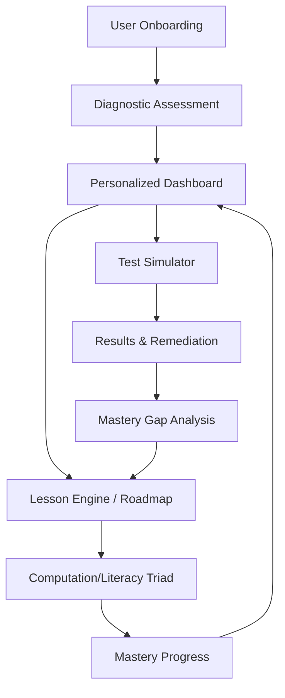

# Praxis MathTrack System Architecture

This document outlines the technical architecture, data flow, and component relationships of the Praxis MathTrack App.

## 🏗️ High-Level User Flow

The application is designed as a circular ecosystem where assessment drives learning, and performance is continuously compared against growth.

---

## 📂 Project Structure

The project follows the Next.js App Router convention with a clear separation between data, components, and page logic.

| Directory | Purpose |
| :--- | :--- |
| `src/app/` | Page routes, layouts, and view logic. |
| `src/data/` | Static JSON "Content Factory" (triadData, practiceTests). |
| `src/components/` | Reusable UI elements (AppShell, Navigation). |
| `src/assets/` | Static assets like logos and brand imagery. |

---

## 📊 Core Data Architecture

The system is powered by two primary JSON "engines" that serve as the single source of truth for both teaching and testing.

### 1. The Lesson Engine (`triadData.json`)
Contains 52 "Mastery Cases," each following the **Pedagogical Triad**:
- **Artifact**: The math problem.
- **Computation**: Interactive numeric/multiple-choice tasks.
- **Literacy A**: Model solution & conceptual narrative.
- **Literacy B**: Error analysis & feedback training.

### 2. The Simulation Engine (`practiceTests.json`)
Contains the assessment framework for Form A:
- **66 Questions**: Mapped to Praxis 5165 domains.
- **Remediation Mapping**: Every question includes a `remediationId` that links directly back to a lesson in `triadData.json`.

---

## 🔄 State & Persistence Model

The application uses browser-based storage to track progress without requiring a backend for the initial version.

| Storage Key | Context | Data Stored |
| :--- | :--- | :--- |
| `mti_completed_lessons` | `localStorage` | Array of IDs for lessons passed in part C. |
| `mti_needs_review_lessons` | `localStorage` | IDs for questions missed in the Simulator. |
| `mti_simulator_answers` | `sessionStorage` | Temporary backup of answers during a live test. |
| `mti_last_test_results` | `localStorage` | Full snapshot of the most recent exam results. |

---

## 🎯 Key Component Workflows

### 1. Lesson Engine Lifecycle
1.  **Selection**: User picks a lesson from the Domain Roadmap.
2.  **Triad Flow**: User passes through Computation -> Literacy A -> Literacy B.
3.  **Completion**: Upon success in part C, the `conceptId` is saved to `localStorage`.
4.  **Feedback**: The Dashboard UI updates a "Untested" badge to a green "✅ Mastered" badge.

### 2. Test Simulator Lifecycle
1.  **Test Start**: Timer (180m) begins; `sessionStorage` initialization.
2.  **Marking**: User can "Mark for Review" to highlight specific boxes in the Question Map.
3.  **Submission**: Results summarized; Scaled Score calculated via formula: $Raw\% \times 100 + 100$.
4.  **Remediation**: Missed question IDs are passed to the `Mastery Gap Analysis` page.

### 3. Mastery Gap Discovery
The **Gap Insight Panel** calculates the delta between **Growth** (Lessons Completed) and **Performance** (Test Accuracy). 
- **Radar Chart**: Compares `mti_completed_lessons` (Lesson Mastery) against `mti_last_test_results` (Test Accuracy) across 5 domains.
